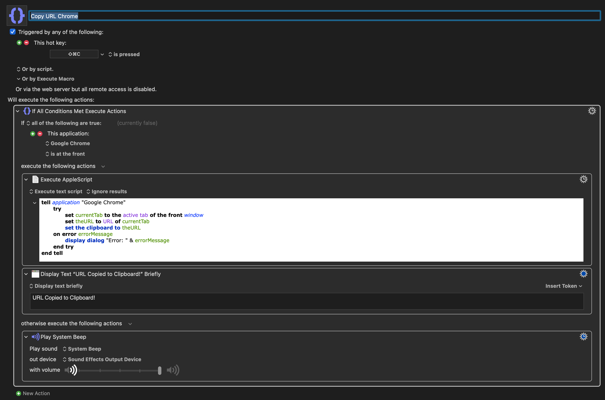

>[!NOTE]
>Se você quiser pular direto para a dica de como configurar o atalho de teclado sem ler o resto, [clique aqui](#configurando-o-keyboard-maestro-com-apple-script).

Há algum tempo tenho me incomodado com o navegador [Arc](https://arc.net/). Desde que a The Browser Company decidiu focar seus esforços em outro lugar, com seus vislumbres baseados em agentes de IA, agora chamado [Dia](https://www.diabrowser.com/), o browser que deu notoriedade pra empresa ficou preso no tempo. Não há mais atualizações de funcionalidade - apenas atualizando a engine por trás de tudo, o Chromium, para manter suporte e call it a day.

Isto não seria grande problema pra mim, desde que o navegador continuasse a funcionar como esperado. Dado que estou escrevendo isso aqui, não foi caso. A realidade é que comecei a ter mais dores de cabeça do que uma boa experiência com o Arc, e a gota d'água pra mim foi quando meus aplicativos já não abriam se o Arc também estivesse aberto. Isso valia para Slack, Linear (app que usamos na empresa para gerenciamento de projetos), e tantos outros.

As telas desses apps ficavam simplesmente em branco, enquanto se eu rodasse a versão de navegador de todos, funcionavam perfeitamente. Por algum tempo achei que poderia ser meu Macbook indo em direção a luz. Uma vez que troquei o Arc de volta para o Chrome como navegador principal, não tive mais esse problema. Pretendo escrever no futuro sobre a mudança, mas por agora, esse Tl;DR serve.

Por ter trocado, não quer dizer que não sinta falta de algumas comodidades do Arc. Estou me adaptando aos poucos, mas uma coisa que achava que precisava realmente ter disponível era o glorioso *__CMD + Shift + C__*.

## CMD + Shift + C

Eu copio muitos links por dia. Não tinha noção do quanto, mas a realidade é que acontece com muita frequência. Compartilhar a URL de um site diretamente do navegador era algo absolutamente comum. Então o CMD + Shift + C, atalho do Arc para copiar a URL da aba que estava visualizando no momento, ficou enraizado em mim. É aquele atalho que, sem ele, meu Mac parecia incompleto.

Procurei navegadores que tivessem isso nativamente e fossem baseados em Chromium (para melhor compatibilidade no meu trabalho) e, pra minha surpresa, não existia nenhum que tinha isso por padrão. Existem navegadores customizáveis como o [Vivaldi](https://vivaldi.com/) que tinham como adicionar esse atalho no navegador, mas o navegador em si era...esquisito. Tinha uma vibe de hack em cima de hack que não me agradava - sem contar que outros aspectos como as abas na vertical, apesar de convidativo, não tinham as mesmas opções que o Arc e deixavam a desejar.

Então voltei pro Chrome, velho de guerra e já conhecido, pensei que faria sentido de momento para não atrapalhar o resto do fluxo de trabalho. E como bom programador não praticante, pensei recentemente se não haveria alguma forma de adicionar essa função em alguma flag escondida do navegador, um script, ou algo do gênero.

<figure>
    
    <figcaption>O Applescript saiu perfeitamente na medida do que queria.</figcaption>
</figure>

Joguei no [T3 Chat](http://t3.chat/) - app que estou testando de momento para interagir com LLMs - e o Gemini me sugeriu Apple Script. Nunca usei, não tenho ideia de como funciona e, por isso, nunca tinha nem passado pela minha cabeça como opção. Então, já pensei em integrar isso ao [Keyboard Maestro](https://www.keyboardmaestro.com/main/) para permitir usar um atalho de teclado, com a condição de o Chrome estar aberto e ser a janela ativa no momento.

## Configurando o Keyboard Maestro com Apple Script

O script que a IA gerou foi esse aqui:

```applescript
tell application "Google Chrome"
    try
        set currentTab to the active tab of the front window
        set theURL to URL of currentTab
        set the clipboard to theURL
    on error errorMessage
        display dialog "Error: " & errorMessage
    end try
end tell
```

Nos meus testes funcionou 100% do tempo, então não pedi para fazer nenhuma alteração. E no Keyboard Maestro, configurei da seguinte forma:

- Hot key SHIFT + CMD + C is pressed
- Execute (if all conditions met)
    - If all of the following are true
    - Google Chrome is at the front
    - Execute Apple Script (acima)
    - Display Text "URL Copied to Clipboard!" Briefly (vai aparecer uma notificação toda vez que rodar o script com sucesso)
- Else
    - Play system beep for error

<figure>
    
    <figcaption>Keyboard Maestro mais uma vez vindo bem a calhar.</figcaption>
</figure>

E pronto! Já tinha o atalho configurado, funcionando 100% do tempo. Espero que seja tão útil pra você quanto foi pra mim 😄